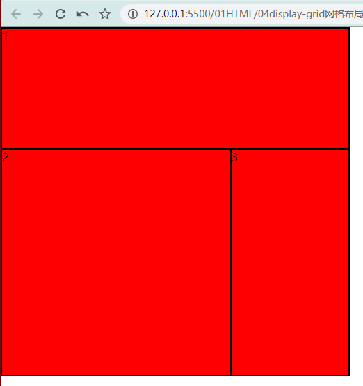

# CSS Grid 网格布局

## 设置 Grid 属性
```css
display: grid;/* 网格布局 */
grid-template-rows: 20% 10% 100px auto;/* 四行 */
grid-template-columns: 100px auto 20%;/* 三列 */
grid-template-rows:repeat(3 , 1fr);/* fr表示占剩余空间的1倍 */
grid-template-columns: repeat(3 , 1fr);/* repeat表示3列都是1fr */
```

## Grid整体布局
```css
  .parent2 {
        display: grid;
        grid-template-columns: repeat(121, 25px);
        grid-template-rows: repeat(70, 25px);
        grid-column-gap: 1px;
        grid-row-gap: 1px;
    }

     .scChild1 {
        grid-area: 1 / 1 / 2 / 2
    }

    /* razor模板构建css */
    @foreach(var tag in Tags)
    {
       
        @("  .divb")@(tag.ID)
        @($"{{ grid-area: {tag.Row1} / {tag.Column1} / {tag.Row2} / {tag.Column2};  }}")
            
    }
```

## 区域划分

```css
 .box {
  width: 500px;height: 500px;
  border: 1px solid #000;
  display: grid;
  /* 网格布局 */
  /* grid-template-rows: 20% 10% 100px auto; */
  /* 四行 */

  /* grid-template-columns: 100px auto 20%; */
  /* 三列 */

  /* grid-template-rows:repeat(3 , 1fr);
  grid-template-columns: repeat(3 , 1fr); */
  
  /* 给每个格子起一个名字 */
  grid-template-areas: 
  "a1 a1 a1"
  "a2 a2 a3"
  "a2 a2 a3";
  
}
.box div{background-color: red; border: 1px solid #000;}
.box div:nth-child(1){grid-area: a1;}
.box div:nth-child(2){grid-area: a2;}
.box div:nth-child(3){grid-area: a3;}
```

```html
<div class="box">
  <div>1</div>
  <div>2</div>
  <div>3</div>
</div>
```



## 间距

```css
grid-row-gap: 20px;/* 每个网格横向的间距 */
grid-column-gap: 10px;/* 每个网格纵向的间距 */
grid-gap: 横向 纵向;/* 复合写法 */
```

## 内容排列

每个小格子里面的内容怎么排列

```css
justify-items: stretch;
align-items: stretch;
```

## 盒子排列

每个格子在大盒子的水平垂直排列  类似display：flex

```css
justify-content: start;
align-content: space-around;

/* 复合写法 */
place-content: 纵向 横向;
```

### 